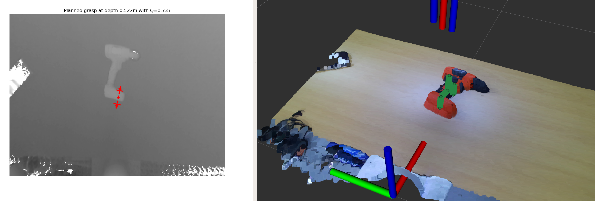
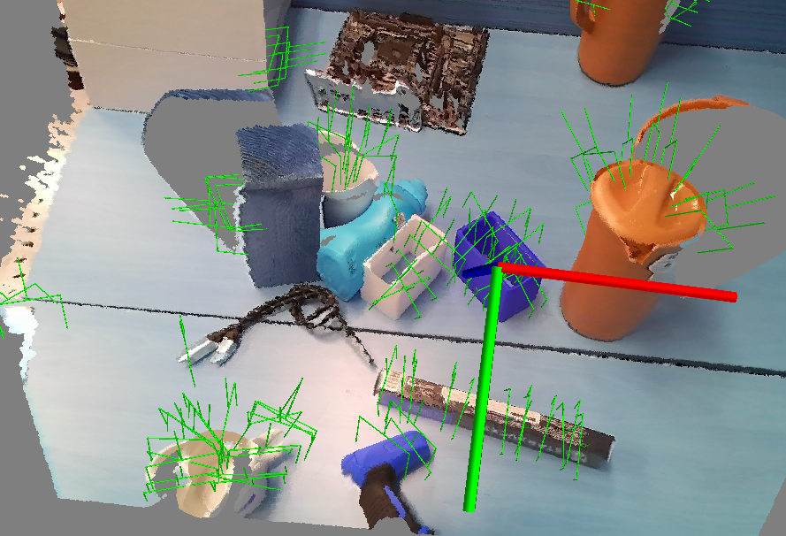

# Deep Grasping ROS

- ROS wrapper for DNN based robotic grasping algorithms
- Support GQ-CNN [[paper]](http://robotics.sciencemag.org/cgi/content/full/4/26/eaau4984?ijkey=IogH9u4mOL70s&keytype=ref&siteid=robotics) [[code]](https://github.com/BerkeleyAutomation/gqcnn)
- Support 6-DoF-GraspNet [[paper]](https://arxiv.org/abs/1905.10520) [[code]](https://github.com/NVlabs/6dof-graspnet)
- Support Contact-GraspNet [[paper]](https://arxiv.org/abs/2103.14127) [[code]](https://github.com/NVlabs/contact_graspnet)


To generate a grasping point, simply use `get_target_grasp_pose` service
```
rosservice call /get_target_grasp_pose
```

Before run the deep grasping nodes, launch camera nodes
```
ROS_NAMESPACE=azure1 roslaunch azure_kinect_ros_driver driver.launch color_resolution:=1440P depth_mode:=WFOV_UNBINNED fps:=5 tf_prefix:=azure1_
```

## TODO

- python 2 --> python 3
- remove TCP connections

## GQ-CNN




### RUN

GQ-CNN Server
```
rosrun deep_grasping_ros gqcnn_server.py
```

GQ-CNN Client
```
conda activate gqcnn
roscd deep_grasping_ros/src/gqcnn && python gqcnn_client.py
```

FC-GQ-CNN Client
```
conda activate gqcnn &&  \
    roscd deep_grasping_ros/src/gqcnn && \
    python fc_gqcnn_client.py
```


## 6-DoF-GraspNet


### Setup

```
conda create -n 6dofgraspnet python=2
python -m pip install -r requirements.txt
cd src && git clone https://github.com/SeungBack/6dof-graspnet
conda activate 6dofgraspnet && pip install -r requirements.txt
```

### RUN


Azure kinect node
```
ros27 && ROS_NAMESPACE=azure1 roslaunch azure_kinect_ros_driver driver.launch color_resolution:=1536P depth_mode:=WFOV_UNBINNED fps:=5 tf_prefix:=azure1_
```

6-dof-graspnet server
```
conda activate 6dofgraspnet \ 
    && roscd deep_grasping_ros/src \
    && python 6dgn_ros_server.py
```

6-dof-graspnet client
```
conda activate 6dofgraspnet \
    && roscd deep_grasping_ros/src/6dof-graspnet \
    && python -m demo.6dgn_client --vae_checkpoint_folder checkpoints/npoints_1024_train_evaluator_0_allowed_categories__ngpus_1_/
```


## Contact-GraspNet



### RUN

Robot
```
cw && ./franka.sh master 
ros27 && roslaunch franka_interface interface.launch load_gripper:=true load_demo_planning_scene:=false

```

Azure kinect node
```
ROS_NAMESPACE=azure1 roslaunch azure_kinect_ros_driver driver.launch color_resolution:=720P depth_mode:=WFOV_UNBINNED fps:=5 tf_prefix:=azure1_

rosrun tf static_transform_publisher 0.078997 0.001502 0.066975 0.697583 -0.005156 0.716441 -0.007980 /panda_hand /azure1_camera_base 100
```

contact graspnet server
```
ros27 && roscd deep_grasping_ros $$ python src/contact_grasp_server.py
```

contact graspnet client

```
conda activate contact_graspnet_env \
    && roscd deep_grasping_ros/src/contact_graspnet \
    && CUDA_VISIBLE_DEVICES=0 python contact_graspnet/contact_grasp_client.py --local_regions --filter_grasps
```

```
conda activate uoais \
    && roscd deep_grasping_ros/src/uoais \
    && CUDA_VISIBLE_DEVICES=1 python demo/uoais_client.py

```


## Authors
* **Seunghyeok Back** [seungback](https://github.com/SeungBack)