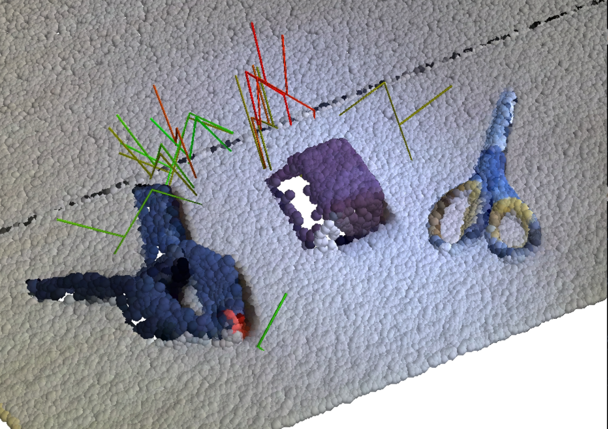

# Deep Grasping ROS

- ROS wrapper for DNN based robotic grasping algorithms
- Currently, only support 6-DoF GraspNet 

## TO DO
- support GGCNN
- support GQCNN
- publish the grasping point as TF
- add install documentation


## 6-DOF-GRASPNET [[paper]](https://arxiv.org/abs/1905.10520) [[code]](https://github.com/NVlabs/6dof-graspnet)

### Setup

```
conda create -n 6dofgraspnet python=2
python -m pip install -r requirements.txt
cd src && git clone https://github.com/SeungBack/6dof-graspnet
conda activate 6dofgraspnet && pip install -r requirements.txt
```

### RUN

Azure kinect node
```
ROS_NAMESPACE=azure1 roslaunch azure_kinect_ros_driver driver.launch color_resolution:=1536P depth_mode:=WFOV_UNBINNED fps:=5 tf_prefix:=azure1_
```

Ros server for 6-dof-graspnet
```
conda activate 6dofgraspnet && cd ~/catkin_ws/src/deep-grasping-ros/src \
    && python 6dgn_ros_server.py
```

Client for 6-dof-graspnet
```
conda activate 6dofgraspnet && \
    cd ~/catkin_ws/src/deep-grasping-ros/src/6dof-graspnet \
    && python -m demo.6dgn_client --gradient_based_refinement
```





## Authors
* **Seunghyeok Back** [seungback](https://github.com/SeungBack)